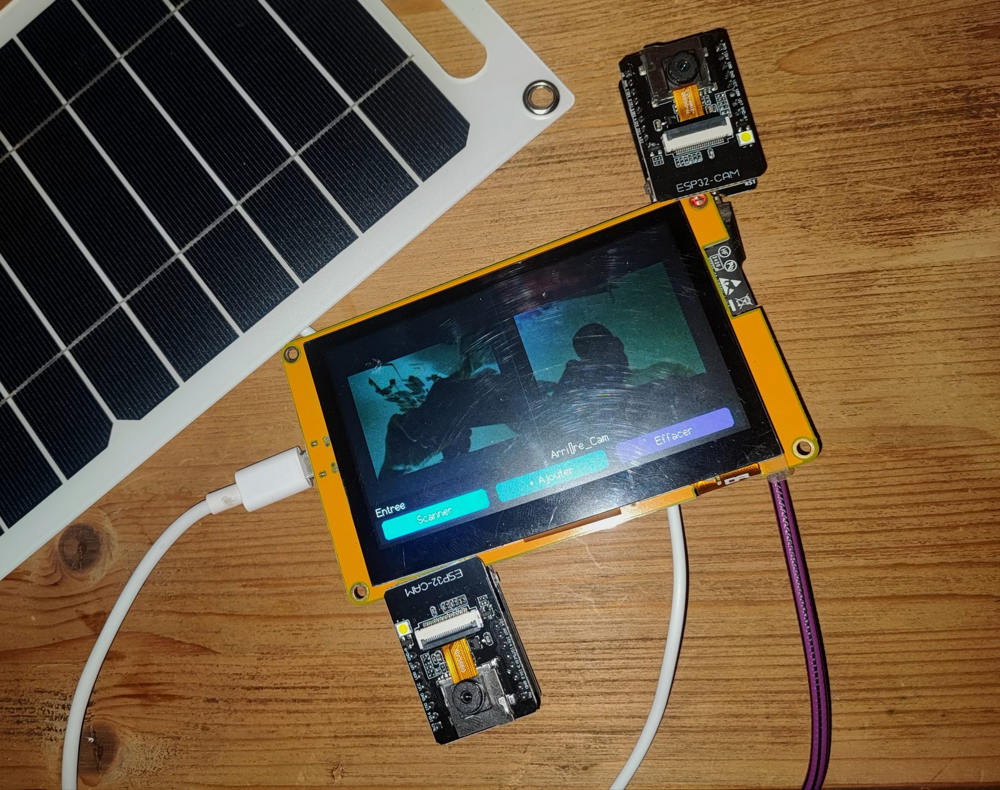
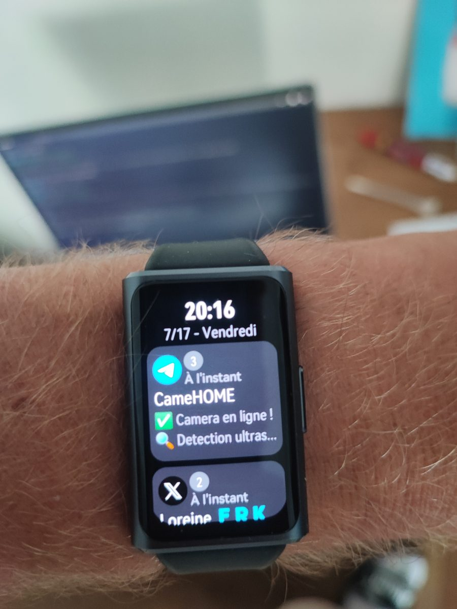
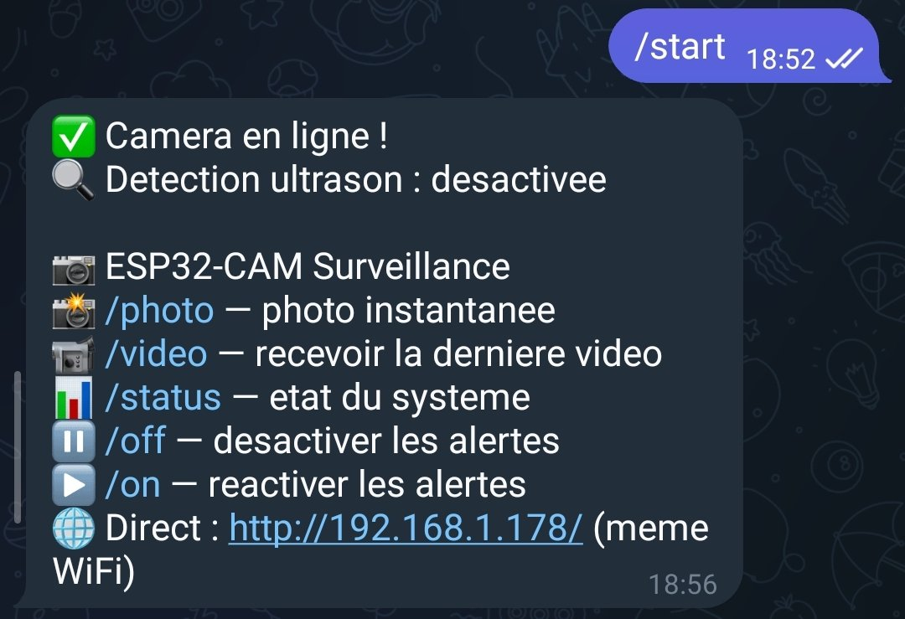
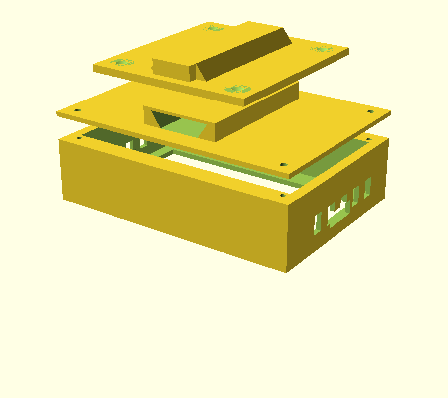
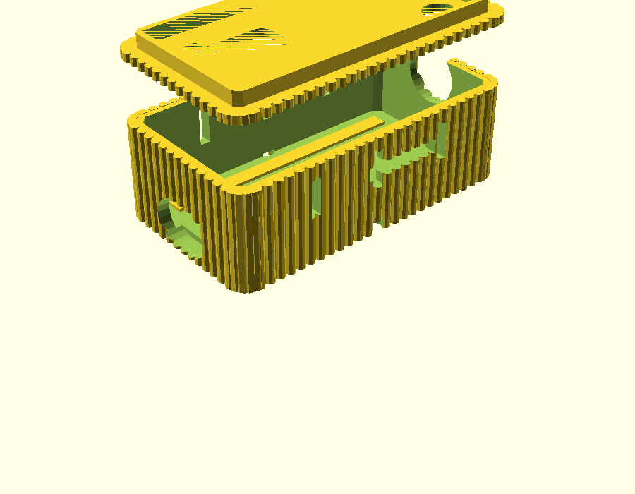

# ESP32-CAM Surveillance System

> A complete DIY smart surveillance ecosystem: ESP32-CAM cameras with Telegram alerts, a tactile multi-camera monitoring console, automatic night lighting, video recording — and a 3D-printable wall-mount case.



---

## ✨ Features



### 📷 ESP32-CAM Camera Firmware
- **Live MJPEG streaming** in any web browser (`/stream`)
- **Telegram alerts**: instant photo + notification on presence detection (HC-SR04 ultrasonic sensor)
- **AVI video recording** to microSD while a presence is detected (5–30 s clips, 10 fps, MJPEG)
- **Two-way Telegram commands**: `/photo`, `/video`, `/status`, `/led`, `/on`, `/off`
- **LED lighting control**: manual (web / Telegram / monitor) + **automatic night mode** (lights on during alerts between 18:00 and 07:00)
- **Web configuration portal**: zero hardcoded credentials — the camera creates its own WiFi AP on first boot
- **Self-healing watchdog**: auto-restart on frozen loop, stalled stream or lost WiFi (24/7 operation)
- **Human-readable camera identity** via `/info` JSON endpoint (used by the monitor console)

_Alerts reach you anywhere — phone, desktop, even your smartwatch._

<br clear="both"/>

### 📺 ESP32-S3 Tactile Monitor (4827S043, 4.3″ 480×272)
- **Multi-camera grid view** (up to 4 cameras, round-robin refresh)
- **Tap a tile → full-screen live stream** (~10–15 fps), tap again → back to grid
- **Automatic discovery**: finds cameras instantly via **mDNS** (with IP-scan fallback)
- **On-screen keypad**: add a camera manually by IP (name auto-fetched)
- **LED toggle button** in full-screen view
- **Same web portal** for WiFi provisioning — no code editing
- Offline camera detection + auto WiFi reconnect

### 🖨️ 3D-Printed Wall-Mount Case
- Frame for the 4827S043 display + compartment for a **flat 10 000 mAh LiPo battery**
- **Dovetail wall plate**: the console slides on/off the wall in one gesture — use it as a portable tablet
- Fully **parametric OpenSCAD** source (adjust to your own battery)

---

## 🏗️ System Architecture

```
                 WiFi LAN
 ┌──────────────────────────────────────────────────┐
 │                                                  │
 │   ESP32-CAM #1          ESP32-CAM #2             │
 │   ┌──────────────┐      ┌──────────────┐         │
 │   │ OV3660       │      │ OV3660       │         │
 │   │ HC-SR04      │      │ HC-SR04      │         │
 │   │ LED lighting │      │ microSD      │         │
 │   └──────┬───────┘      └──────┬───────┘         │
 │          │ MJPEG/JSON           │                │
 │          ▼                      ▼                │
 │   ┌───────────────────────────────────┐          │
 │   │  ESP32-S3 Monitor (4827S043)      │          │
 │   │  grid view · full-screen · scan   │          │
 │   └───────────────────────────────────┘          │
 │                                                  │
 └──────────────────────────────────────────────────┘
                          │
                          ▼ HTTPS
                   Telegram Bot API
              (alerts, photos, videos, commands)
```

---

## 🧰 Hardware Requirements

| Qty | Part | Notes |
|----:|------|-------|
| 1+ | ESP32-CAM (AI-Thinker / Binghe) + OV3660 | One per camera |
| 1 | ESP32-4827S043 (ESP32-S3 + 4.3″ capacitive touch) | Monitor console |
| 1+ | HC-SR04 ultrasonic sensor | Presence detection (optional) |
| 1+ | microSD card (FAT32, ≤ 32 GB) | Video recording (optional) |
| 1 | LED (+ 220 Ω resistor) or onboard flash LED | Night lighting |
| 1 | Flat 10 000 mAh LiPo battery | For the portable console |
| — | FTDI programmer / USB cables | Flashing |

---

## 🚀 Getting Started

### 1. Flash the camera

```bash
arduino-cli compile --fqbn esp32:esp32:esp32cam firmware/esp32-cam
arduino-cli upload  --fqbn esp32:esp32:esp32cam -p COMx firmware/esp32-cam
```

> Flashing an ESP32-CAM requires **GPIO 0 → GND** at boot. **Remove the jumper and press RESET afterwards**, otherwise the board stays in download mode.

### 2. Configure via the web portal (no code editing!)

1. On first boot, the camera creates the WiFi network **`ESP32-CAM-Setup-xxxx`** (password: `12345678`)
2. Connect and open **http://192.168.4.1**
3. Fill in: **WiFi credentials**, **Telegram bot token + chat ID**, **camera name**, detection distance
4. The camera reboots onto your LAN and sends *"✅ Camera online"* to your Telegram

The same portal stays available anytime at `http://<camera-ip>/setup`.

### 3. Create the Telegram bot (5 min)

1. In Telegram, open **@BotFather** → `/newbot` → copy the **token**
2. Send any message to your new bot
3. Get your **chat ID** instantly from **@userinfobot**
4. Enter both values in the web portal

### 4. Flash the S3 monitor

```bash
arduino-cli lib install "LovyanGFX"
arduino-cli compile --fqbn "esp32:esp32:esp32s3:FlashSize=8M,PSRAM=opi,PartitionScheme=huge_app,CPUFreq=240,USBMode=hwcdc,CDCOnBoot=cdc" firmware/esp32-s3-monitor
arduino-cli upload  --fqbn "esp32:esp32:esp32s3:FlashSize=8M,PSRAM=opi,PartitionScheme=huge_app,CPUFreq=240,USBMode=hwcdc,CDCOnBoot=cdc" -p COMx firmware/esp32-s3-monitor
```

Board options: **ESP32S3 Dev Module**, PSRAM **OPI**, Flash **8MB** (N8R8) or 16MB (N16R8), partition **Huge APP**, USB CDC On Boot **Enabled**.

On first boot the monitor shows its own provisioning screen (`ESP32-Viewer-Setup-xxxx`, same procedure). Then tap **[Scanner]** — it discovers your cameras automatically.

---

## 🤖 Telegram Commands



| Command | Action |
|---------|--------|
| `/photo` | Instant photo from the camera |
| `/video` | Receive the last recorded AVI clip |
| `/led` `/ledon` `/ledoff` `/ledauto` | Lighting control |
| `/on` `/off` | Enable / disable automatic alerts |
| `/status` | IP, uptime, distance, SD, videos, LED, night mode |
| `/help` | Command list |

## 🌐 Camera HTTP API

| Endpoint | Description |
|----------|-------------|
| `GET /` | Web dashboard (live view + links) |
| `GET /stream` | MJPEG live stream — `?fs=qvga/cif/hvga/vga/svga`, `?q=10..30` |
| `GET /capture` | Single JPEG snapshot |
| `GET /video` | Download last AVI recording |
| `GET /list` | List/download all recordings |
| `GET /led?state=on\|off\|toggle\|auto` | Lighting control (JSON) |
| `GET /info` | Camera identity + state (JSON) |
| `GET /setup` | Configuration portal |

---

## 🔌 Wiring

### HC-SR04 ultrasonic sensor (optional — presence detection)

```
HC-SR04          ESP32-CAM
-------          ---------
VCC    ────────► 5V
GND    ────────► GND
TRIG   ────────► GPIO 13
ECHO   ──[1kΩ]──► GPIO 12 ──[2kΩ]──► GND     ← voltage divider (mandatory)
```

> ⚠️ ECHO outputs 5 V — the divider protects the 3.3 V GPIO. The microSD slot works in **1-bit mode**, leaving GPIO 12/13 free.

Then set `DETECTION_ULTRASON = true` in the camera firmware and reflash.

### LED lighting

Use the onboard flash LED (GPIO 4) directly, or wire an external LED:

```
LED anode (+) ──[220Ω]── GPIO 4
LED cathode (−) ──────── GND
```

Both light up together — perfect for night illumination. For a high-power LED, drive it through an NPN transistor.

**Automatic night mode**: on any alert between **18:00 and 07:00**, the LED turns on for the photo and the whole video, then switches off. Manual control always takes priority.

---

## 🖨️ 3D-Printed Cases

### Monitor case (wall-mount / tabletop)

Parametric OpenSCAD source + ready-to-print STLs in [`hardware/case/`](hardware/case).



| Part | File | Print orientation |
|------|------|-------------------|
| Main body | `boitier_corps.stl` | Screen frame facing the bed |
| Back cover (dovetail female) | `boitier_couvercle.stl` | Rail facing up |
| Wall plate (dovetail male) | `boitier_plaque_murale.stl` | Flat, rail facing up |

- No supports needed · PLA/PETG · 0.2 mm layers · 3 walls · 20 % infill
- Assembly: 4× M2 self-tapping screws (cover), 4× wood screws (wall plate)
- **Battery**: measure yours and adjust `bat_w / bat_h / bat_d` in `boitier_4827S043.scad`, then re-export:

```bash
openscad -o boitier_corps.stl -D part=1 boitier_4827S043.scad
```

### Camera case (ESP32-CAM + programming board)

Snap-fit enclosure for an ESP32-CAM stacked on its **ESP32-CAM-MB USB programming board** — thin **1.6 mm walls** with a vertical ribbed texture. STLs + parametric source in [`hardware/case-esp32cam/`](hardware/case-esp32cam).



| Part | File | Print orientation |
|------|------|-------------------|
| Body | `esp32cam_case_body.stl` | Upright, bottom on the bed |
| Friction lid | `esp32cam_case_lid.stl` | Plate on the bed |

- No supports · PLA/PETG · 0.2 mm layers · ~1h30 total
- Lens / flash / micro-USB / microSD / antenna openings + 2× M3 mount holes
- **Measure your stack** and adjust `in_l / in_w / in_h`, `cam_z`, `lid_clr`… at the top of `esp32cam_mb_case.scad`

---

## 📁 Project Structure

```
esp32-cam-surveillance-system/
├── firmware/
│   ├── esp32-cam/              # Camera firmware (Arduino)
│   │   ├── esp32-cam-surveillance.ino
│   │   └── avi_writer.h        # Minimal MJPEG→AVI writer
│   └── esp32-s3-monitor/       # Tactile monitor firmware (LovyanGFX)
│       └── esp32-viewer-s3.ino
├── hardware/
│   ├── case/                   # Monitor case (OpenSCAD + STLs)
│   ├── case-esp32cam/          # Camera case for ESP32-CAM + MB board
│   └── images/                 # Renders & sample captures
├── docs/
├── LICENSE
└── README.md
```

## 🧠 Design Notes

- **Grid refresh** uses per-camera `/capture` round-robin (light on bandwidth); **full-screen** uses the dedicated MJPEG `/stream`.
- The microSD slot runs in **1-bit SD_MMC mode**, keeping GPIO 12/13 free for the ultrasonic sensor.
- AVI files use a minimal MJPEG writer (`avi_writer.h`) — playable in VLC and shareable via Telegram.
- All credentials persist in **NVS (Preferences)** — survives power loss, no SD dependency.
- The watchdog task runs on the **second core**, so even a fully frozen main loop gets restarted.

## 🗺️ Roadmap

- [ ] PIR wake-up + deep sleep for battery-powered cameras
- [ ] Home Assistant integration (MJPEG camera + MQTT alerts)
- [ ] Remote access via Tailscale
- [ ] Auto full-screen on the monitor when a camera triggers
- [x] mDNS camera auto-discovery (instant — cameras also reachable at `http://<name>.local`)

## ⚠️ Disclaimer

This is a DIY hobby project. Do not use it as your only security system. Respect privacy laws when installing cameras.

## 📄 License

MIT License — see [LICENSE](LICENSE).
